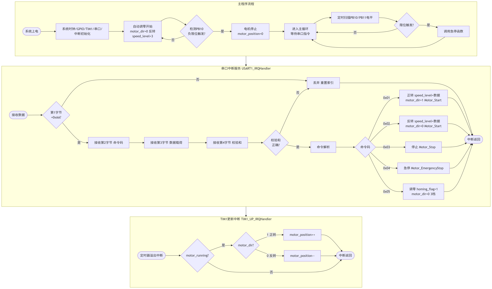

# 下位机程序说明（STM32F103C8T6）

本程序为视觉伺服直线运动平台的下位机部分，运行于 STM32F103C8T6 单片机。主要功能包括：接收上位机通过串口发送的运动指令，解析指令并控制步进电机正转、反转、停止、急停、回零，输出 PWM 脉冲与方向信号驱动 DM542 控制 57 步进电机，读取限位开关状态实现限位保护与回零，并通过定时器中断进行位置计数。

---

## 开发环境

| 项目 | 说明 |
|------|------|
| 芯片 | STM32F103C8T6（48 引脚 LQFP，72MHz） |
| 开发工具 | Keil MDK 5 |
| 固件库 | STM32 标准外设库（StdPeriph Lib） |
| 下载工具 | FlyMcu（串口下载）或 ST-Link |
| 调试工具 | SSCOM 串口助手、万用表、示波器 |

---

## 目录结构

```
lower_computer/
├── User/                   # 用户代码
│   ├── main.c              # 主函数：初始化 + 主循环
│   ├── stm32f10x_it.c      # 中断服务函数
│   └── stm32f10x_it.h
├── Hardware/               # 硬件驱动
│   ├── motor.c / motor.h   # 电机控制：PWM、方向、启停
│   ├── limit.c / limit.h   # 限位开关读取
│   ├── serial.c / serial.h # 串口通信与命令解析
│   ├── timer.c / timer.h   # TIM1 PWM 配置与更新中断
│   └── delay.c / delay.h   # 延时函数
├── Library/                # STM32 标准外设库
├── Start/                  # 启动文件
├── System/                 # 系统文件
└── Project/                # Keil 工程文件
    ├── Project.uvprojx
    └── Project.uvoptx
```

如果你的工程目录不同，请按实际结构调整。

---

## 编译与下载

用 Keil MDK 5 打开 `Project/Project.uvprojx`，点击 Build 编译工程，确认无错误后生成 `.hex` 文件（默认在 `Objects/` 目录下）。然后使用 FlyMcu 通过串口下载：选择正确串口（CH340 对应的 COM 口），波特率一般选 115200，加载 `.hex` 文件，点击“开始编程”。下载完成后给 STM32 重新上电，程序开始运行。也可使用 ST-Link 通过 SWD 接口下载调试。

---

## 引脚分配

| 引脚 | 功能 | 说明 |
|------|------|------|
| PA8 | TIM1_CH1 PWM 输出 | 脉冲信号，接 DM542 的 PUL- |
| PB5 | GPIO 输出 | 方向控制，低电平正转，高电平反转，接 DM542 的 DIR- |
| PB10 | GPIO 输入（上拉） | 负限位/零点光电开关，低电平触发 |
| PB11 | GPIO 输入（上拉） | 正限位光电开关，低电平触发 |
| PA9 | USART1_TX | 串口发送（备用调试） |
| PA10 | USART1_RX | 串口接收，接 CH340 的 TX |
| PA13 | SWDIO | 程序下载与调试 |
| PA14 | SWCLK | 程序下载与调试 |
| VDD/VSS | 电源 | 3.3V 供电与接地 |

### DM542 接线

| DM542 端子 | 接到 | 说明 |
|------------|------|------|
| PUL+ | +5V | 共阳极 |
| PUL- | PA8 | 脉冲 |
| DIR+ | +5V | 共阳极 |
| DIR- | PB5 | 方向 |
| ENA+ / ENA- | 悬空 | 不使能 |
| VCC | +24V | 主电源 |
| GND | 24V GND | 地 |
| A+ / A- / B+ / B- | 57 步进电机 | 两相四线 |

---

## 功能说明

### 1. 初始化回零

上电后程序自动进入回零状态：电机以 3 档低速反转，直到 PB10 检测到负限位触发，电机停止并将位置变量清零。

### 2. 手动控制

通过串口接收上位机指令：

| 命令码 | 功能 | 数据 |
|--------|------|------|
| 0x01 | 正转 | 速度档位 1~10 |
| 0x02 | 反转 | 速度档位 1~10 |
| 0x03 | 停止 | 0x00 |
| 0x04 | 急停 | 0x00 |
| 0x05 | 调零 | 0x00 |

### 3. 限位保护

主循环中定时读取 PB10 和 PB11 电平，当限位触发时立即停止电机，防止超出行程。同时支持外部中断方式，具体见实际代码。

### 4. 位置计数

TIM1 更新中断中，每产生一个脉冲，根据方向标志对位置变量递增或递减，用于调试参考。

### 5. 速度档位

通过查表方式设置 TIM1 的 ARR 值，实现 10 档速度，对应电机转速约 15~200rpm。

---

## 串口通信协议

上下位机采用固定 4 字节帧格式：

```
AA + CMD + DATA + CHECKSUM
```

其中 AA 为帧头，CMD 为命令码，DATA 为数据（速度档位或 0x00），CHECKSUM 为 `(AA + CMD + DATA) & 0xFF`。

| CMD | 功能 | DATA |
|-----|------|------|
| 0x01 | 正转 | 1~10 |
| 0x02 | 反转 | 1~10 |
| 0x03 | 停止 | 0x00 |
| 0x04 | 急停 | 0x00 |
| 0x05 | 调零 | 0x00 |

指令示例：

| 功能 | 指令 (HEX) |
|------|------------|
| 正转 5 档 | `AA 01 05 B0` |
| 反转 5 档 | `AA 02 05 B1` |
| 停止 | `AA 03 00 AD` |
| 急停 | `AA 04 00 AE` |
| 调零 | `AA 05 00 AF` |

---

## 调试说明

### 下位机独立调试

使用 SSCOM 串口助手，波特率 115200，十六进制发送。先发送调零指令 `AA 05 00 AF`，观察电机是否向负限位方向运动并停止。然后发送正转 `AA 01 05 B0`、反转 `AA 02 05 B1`、停止 `AA 03 00 AD`、急停 `AA 04 00 AE`，验证功能。用手遮挡限位开关，电机应立即停止。串口助手可接收到 STM32 打印的调试信息，如 `Forward, speed level: 5`。

### 常见问题

| 现象 | 可能原因 | 解决方法 |
|------|----------|----------|
| 电机不转 | 接线松动、PUL+ 未接 +5V | 检查接线，确认共阳极 |
| 方向相反 | 电机相序接反 | 交换 A+ 与 A- |
| 调零后电机缓转 | PWM_Stop 未关主输出 | 在 PWM_Stop 中调用 `TIM_CtrlPWMOutputs(TIM1, DISABLE)` |
| 限位不触发 | 光电开关供电或接线问题 | 检查 5V 供电与信号线 |
| 串口无响应 | 波特率或串口线接错 | 确认 115200，TX/RX 交叉连接 |

---
## 流程图



---

## 备注

本程序为课程设计版本，采用 STM32 标准外设库开发。如需修改速度档位或加减速参数，可在 `timer.c` 中调整 ARR 查表值。位置计数变量在 `motor.c` 中定义，可通过串口打印观察。程序未使用编码器，为开环控制，后续可增加编码器实现闭环。

---

## 作者

- 郭司南
- 内蒙古工业大学 机械工程学院 机械电子工程
